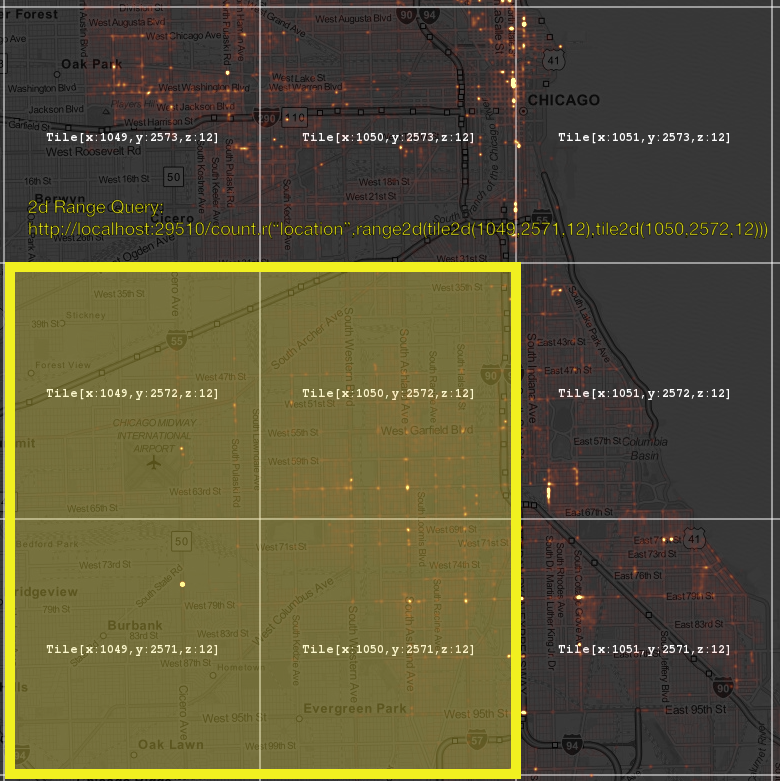

# Dimensions and Bins

Nanocubes is all about binning multi-dimenstional data. As a running
example, let's consider a table like the Chicago crime one:

    latitude | longitude | timestamp | type

How many records in the geo-location table fall into a certain spatial
bin? Or is of type `theft`? By efficiently pre-computing and storing
counts or measures, nanocube can handle a good amount of records in a
few dimensions (e.g. one or two spatial dimensions, one temporal dimension,
a few categorical dimensions) to solve queries at interactive rates. 

# Paths

A *path* is the identifier of a *bin* in a *dimension* of a
nanocube. This *bin* can be either an aggregate one or a finest
resolution one. For example, if we have a dimension for a categorical
variable "device" represented as a two level tree, the root represents
any device and a leaf might represent an `iPhone` or `Android`.

# Target

A *target* for a dimension restricts the set of records of interest to
the ones that are in a particular set of *bins* in that dimension. For
example, if we have a categorical dimension with US States as *bins*,
we can think of `{NY, LA, UT}` as a *target* for that dimension. More
formally, a *target* for dimension *d* specifies a set of *paths* that
should be visited every time the execution engine that is solving a
query needs to traverse a *binning hierarchy* on dimensions *d*. If a
certain *path* in the *target* is not present for a particular *bin
hierarchy* instance, then, obviously, this path will not be visited.

## Multi-Target

Sometimes we want to collect separetely values of multiple targets on
a single dimension. For example, we might want to query multiple
consecutive intervals from a binary tree representation for time. Each
interval data can be "solved" by visiting a (minimal) set of time bins
that is a cover for it (the interval).

# Services

## `.schema`

The schema reports all of the dimensions (i.e. fields) of the nanocube
and their types.

In this example, there are four fields with names:
`location`, `crime`, `time`, and `count`.  The types of these fields
are (roughly) described as: quadree with 25 levels, categorical with 1
byte, time with 2 bytes, and unsigned integer with 4 bytes. Also
specified for each field are the valid values of these fields.  In
this example, we only really need to specify them for the categorical
dimension `crime` which lists the names and values of the criminal
offenses. There is also some additional metadata reported to indicate
when the time dimension should begin, how large the time bins are, how
to project the quadtree onto a map, and the original data file name.

```
# Schema
http://localhost:29512/schema

{ "fields":[ { "name":"location", "type":"nc_dim_quadtree_25", "valnames":{  } }, { "name":"crime", "type":"nc_dim_cat_1", "valnames":{ "OTHER_OFFENSE":22, "NON-CRIMINAL_(SUBJECT_SPECIFIED)":18, "NARCOTICS":16, "GAMBLING":9, "MOTOR_VEHICLE_THEFT":15, "OTHER_NARCOTIC_VIOLATION":21, "OBSCENITY":19, "HOMICIDE":10, "THEFT":29, "DECEPTIVE_PRACTICE":8, "CRIMINAL_DAMAGE":5, "STALKING":28, "BATTERY":2, "PUBLIC_PEACE_VIOLATION":25, "PUBLIC_INDECENCY":24, "ASSAULT":1, "BURGLARY":3, "ROBBERY":26, "LIQUOR_LAW_VIOLATION":14, "INTERFERENCE_WITH_PUBLIC_OFFICER":11, "NON-CRIMINAL":17, "PROSTITUTION":23, "ARSON":0, "INTIMIDATION":12, "SEX_OFFENSE":27, "CONCEALED_CARRY_LICENSE_VIOLATION":4, "OFFENSE_INVOLVING_CHILDREN":20, "KIDNAPPING":13, "CRIM_SEXUAL_ASSAULT":7, "WEAPONS_VIOLATION":30, "CRIMINAL_TRESPASS":6 } }, { "name":"time", "type":"nc_dim_time_2", "valnames":{  } }, { "name":"count", "type":"nc_var_uint_4", "valnames":{  } } ], "metadata":[ { "key":"location__origin", "value":"degrees_mercator_quadtree25" }, { "key":"tbin", "value":"2013-12-01_00:00:00_3600s" }, { "key":"name", "value":"crime50k.csv" } ] }
```

## `.count`

Returns the sum of values in a certain product bin.

The following examples of API calls show the initial query and then the returned results.

```
## No constraints example
http://localhost:29512/count

{ "layers":[  ], "root":{ "val":50000 } }
```

```
## split on space (quadtree path 2,1,2) on a 256x256 image
http://localhost:29512/count.a("location",dive([2,1,2],8))

{ "layers":[ "anchor:location" ], "root":{ "children":[ { "path":[2,1,2,0,0,0,0,1,3,2,3], "val":7606 }, { "path":[2,1,2,0,0,0,0,1,3,1,2], "val":224 }, { "path":[2,1,2,0,0,0,0,1,2,3,3], "val":272 }, { "path":[2,1,2,0,0,0,0,1,3,2,2], "val":5461 }, { "path":[2,1,2,0,0,0,0,1,3,2,1], "val":16914 }, { "path":[2,1,2,0,0,0,0,1,3,2,0], "val":6839 }, { "path":[2,1,2,0,0,0,0,1,3,0,3], "val":12268 }, { "path":[2,1,2,0,0,0,0,1,3,0,2], "val":416 } ] } }
```

```
## restrict to a rectangular area (see figure below).  Specify lower-left and upper-right bounds.
http://localhost:29512/count.r("location",range2d(tile2d(1049,2571,12),tile2d(1050,2572,12)))

{ "layers":[  ], "root":{ "val":11167 } }
```




```
## split on time: base time bin = 480, bucket has 24 bins, get 10 buckets (if they exist)
http://localhost:29512/count.r("time",mt_interval_sequence(480,24,10))

{ "layers":[ "multi-target:time" ], "root":{ "children":[ { "path":[0], "val":762 }, { "path":[1], "val":724 }, { "path":[2], "val":660 }, { "path":[3], "val":515 }, { "path":[4], "val":410 }, { "path":[5], "val":584 }, { "path":[6], "val":713 }, { "path":[7], "val":712 }, { "path":[8], "val":704 }, { "path":[9], "val":617 } ] } }
```

```
## combine location and time queries above (time series for each pixel)
http://localhost:29512/count.a("location",dive([2,1,2],8)).r("time",mt_interval_sequence(480,24,10))

{ "layers":[ "anchor:location", "multi-target:time" ], "root":{ "children":[ { "path":[2,1,2,0,0,0,0,1,3,2,3], "children":[ { "path":[0], "val":111 }, { "path":[1], "val":120 }, { "path":[2], "val":101 }, { "path":[3], "val":94 }, { "path":[4], "val":59 }, { "path":[5], "val":69 }, { "path":[6], "val":88 }, { "path":[7], "val":106 }, { "path":[8], "val":102 }, { "path":[9], "val":84 } ] }, { "path":[2,1,2,0,0,0,0,1,3,1,2], "children":[ { "path":[0], "val":4 }, { "path":[1], "val":1 }, { "path":[2], "val":2 }, { "path":[3], "val":1 }, { "path":[4], "val":5 }, { "path":[5], "val":2 }, { "path":[6], "val":3 }, { "path":[7], "val":5 }, { "path":[8], "val":3 }, { "path":[9], "val":1 } ] }, { "path":[2,1,2,0,0,0,0,1,2,3,3], "children":[ { "path":[0], "val":2 }, { "path":[1], "val":6 }, { "path":[2], "val":6 }, { "path":[3], "val":5 }, { "path":[4], "val":3 }, { "path":[5], "val":5 }, { "path":[6], "val":4 }, { "path":[7], "val":5 }, { "path":[8], "val":6 }, { "path":[9], "val":1 } ] }, { "path":[2,1,2,0,0,0,0,1,3,2,2], "children":[ { "path":[0], "val":103 }, { "path":[1], "val":77 }, { "path":[2], "val":65 }, { "path":[3], "val":52 }, { "path":[4], "val":62 }, { "path":[5], "val":72 }, { "path":[6], "val":88 }, { "path":[7], "val":80 }, { "path":[8], "val":76 }, { "path":[9], "val":58 } ] }, { "path":[2,1,2,0,0,0,0,1,3,2,1], "children":[ { "path":[0], "val":270 }, { "path":[1], "val":227 }, { "path":[2], "val":248 }, { "path":[3], "val":161 }, { "path":[4], "val":119 }, { "path":[5], "val":175 }, { "path":[6], "val":233 }, { "path":[7], "val":234 }, { "path":[8], "val":259 }, { "path":[9], "val":216 } ] }, { "path":[2,1,2,0,0,0,0,1,3,2,0], "children":[ { "path":[0], "val":101 }, { "path":[1], "val":93 }, { "path":[2], "val":86 }, { "path":[3], "val":61 }, { "path":[4], "val":71 }, { "path":[5], "val":104 }, { "path":[6], "val":106 }, { "path":[7], "val":117 }, { "path":[8], "val":86 }, { "path":[9], "val":93 } ] }, { "path":[2,1,2,0,0,0,0,1,3,0,3], "children":[ { "path":[0], "val":165 }, { "path":[1], "val":194 }, { "path":[2], "val":147 }, { "path":[3], "val":135 }, { "path":[4], "val":90 }, { "path":[5], "val":150 }, { "path":[6], "val":181 }, { "path":[7], "val":160 }, { "path":[8], "val":164 }, { "path":[9], "val":160 } ] }, { "path":[2,1,2,0,0,0,0,1,3,0,2], "children":[ { "path":[0], "val":6 }, { "path":[1], "val":6 }, { "path":[2], "val":5 }, { "path":[3], "val":6 }, { "path":[4], "val":1 }, { "path":[5], "val":7 }, { "path":[6], "val":10 }, { "path":[7], "val":5 }, { "path":[8], "val":8 }, { "path":[9], "val":4 } ] } ] } }
```

```
## tile2d example tile2d(x,y,level)... x,y in {0,...,2^level-1}x{0,...,2^level-1}
http://localhost:29512/count.a("location",dive(tile2d(1,2,2),8))

{ "layers":[ "anchor:location" ], "root":{ "children":[ { "path":[2,1,2,0,0,0,0,1,3,2], "val":36820 }, { "path":[2,1,2,0,0,0,0,1,3,1], "val":224 }, { "path":[2,1,2,0,0,0,0,1,3,0], "val":12684 }, { "path":[2,1,2,0,0,0,0,1,2,3], "val":272 } ] } }
```

```
## same as above, but passing the "img" formatting hint for bidimensional image addresses (relative address to tile(1,2,2))
http://localhost:29512/count.a("location",dive(tile2d(1,2,2),8),"img")

{ "layers":[ "anchor:location" ], "root":{ "children":[ { "x":6, "y":131, "val":36820 }, { "x":7, "y":130, "val":224 }, { "x":6, "y":130, "val":12684 }, { "x":5, "y":131, "val":272 } ] } }
```

```
## branch on the "crime" type
http://localhost:29512/count.a("crime",dive([],1))

{ "layers":[ "anchor:crime" ], "root":{ "children":[ { "path":[21], "val":2 }, { "path":[20], "val":456 }, { "path":[19], "val":1 }, { "path":[18], "val":1 }, { "path":[17], "val":1 }, { "path":[16], "val":5742 }, { "path":[15], "val":2226 }, { "path":[14], "val":69 }, { "path":[13], "val":46 }, { "path":[12], "val":21 }, { "path":[11], "val":229 }, { "path":[10], "val":69 }, { "path":[0], "val":63 }, { "path":[1], "val":2629 }, { "path":[2], "val":8990 }, { "path":[3], "val":2933 }, { "path":[4], "val":1 }, { "path":[5], "val":4660 }, { "path":[6], "val":1429 }, { "path":[7], "val":181 }, { "path":[8], "val":2190 }, { "path":[9], "val":2 }, { "path":[22], "val":3278 }, { "path":[23], "val":211 }, { "path":[24], "val":2 }, { "path":[25], "val":441 }, { "path":[26], "val":2132 }, { "path":[27], "val":119 }, { "path":[28], "val":20 }, { "path":[29], "val":11367 }, { "path":[30], "val":489 } ] } }
```

```
## set target 
http://localhost:29512/count.r("crime",set([1],[3]))

{ "layers":[  ], "root":{ "val":5562 } }
```

```
## ... or a shortcut for addresses in the first level of a binning structure
http://localhost:29512/count.r("crime",set(1,3))

{ "layers":[  ], "root":{ "val":5562 } }
```

```
## image restricted to a time interval [a,b]
http://localhost:29512/count.r("time",interval(484,500)).a("location",dive(tile2d(262,643,10),1),"img")

{ "layers":[ "anchor:location" ], "root":{ "children":[ { "x":1, "y":1, "val":67 }, { "x":1, "y":0, "val":188 }, { "x":0, "y":1, "val":65 }, { "x":0, "y":0, "val":74 } ] } }
```

```
## a time series of images (time series for each pixel)
http://localhost:29512/count.r("time",mt_interval_sequence(484,1,5)).a("location",dive(tile2d(262,643,10),1),"img")

{ "layers":[ "anchor:location", "multi-target:time" ], "root":{ "children":[ { "x":1, "y":1, "children":[ { "path":[0], "val":5 }, { "path":[1], "val":2 }, { "path":[2], "val":1 }, { "path":[4], "val":1 } ] }, { "x":1, "y":0, "children":[ { "path":[0], "val":1 }, { "path":[1], "val":3 }, { "path":[2], "val":6 }, { "path":[3], "val":4 }, { "path":[4], "val":11 } ] }, { "x":0, "y":1, "children":[ { "path":[0], "val":1 }, { "path":[1], "val":3 }, { "path":[2], "val":1 }, { "path":[3], "val":3 }, { "path":[4], "val":1 } ] }, { "x":0, "y":0, "children":[ { "path":[0], "val":3 }, { "path":[1], "val":1 }, { "path":[3], "val":3 }, { "path":[4], "val":2 } ] } ] } }
```

```
## degrees_mask (longitude,latitude) single contour
http://localhost:29512/count.r("location",degrees_mask("-87.6512,41.8637,-87.6512,41.9009,-87.6026,41.9009,-87.6026,41.8637",25))

{ "layers":[  ], "root":{ "val":3344 } }
```

## unsorted
http://localhost:29512/count.a("location",mask("012<<12<<<",10))
http://localhost:29512/count.a("location",region("us_states/newyork",10))   // search directory
http://localhost:29512/count.a("location",mercator_mask("x0,y0,x1,y1,...,xn,yn;x0,y0,x1,y1,x2,y2",10))
http://localhost:29512/count.a("location",degrees_mask("x0,y0,x1,y1,...,xn,yn;x0,y0,x1,y1,x2,y2",10))


## `.timing`

Timing

### Output Encoding

There are three kinds of encodings: json (default), text, and
binary. To activate these methods (the last activated will be used)
three functions are avaiable on the queries: `.json()`, `.text()`,
`.bin()`.

# ToDo

- Access of Multiple Variables


<!-- sophia@oreilly.com -->

<!--     server.port = options.query_port.getValue(); -->
    
<!--     bool json        = true; -->
<!--     bool binary      = false; -->
<!--     bool compression = true; -->
<!--     bool plain       = false; -->
    
<!--     auto json_query_handler    = std::bind(&NanocubeServer::serveQuery, this, std::placeholders::_1, json,       plain); -->
<!--     auto binary_query_handler  = std::bind(&NanocubeServer::serveQuery, this, std::placeholders::_1, binary,     plain); -->
<!--     auto json_tquery_handler   = std::bind(&NanocubeServer::serveTimeQuery, this, std::placeholders::_1, json,   plain); -->
<!--     auto binary_tquery_handler = std::bind(&NanocubeServer::serveTimeQuery, this, std::placeholders::_1, binary, plain); -->
<!--     // auto json_query_comp_handler    = std::bind(&NanocubeServer::serveQuery, this, std::placeholders::_1, json,       compression); -->
<!--     // auto json_tquery_comp_handler   = std::bind(&NanocubeServer::serveTimeQuery, this, std::placeholders::_1, json,   compression); -->
<!--     auto binary_query_comp_handler  = std::bind(&NanocubeServer::serveQuery, this, std::placeholders::_1, binary,     compression); -->
<!--     auto binary_tquery_comp_handler = std::bind(&NanocubeServer::serveTimeQuery, this, std::placeholders::_1, binary, compression); -->
<!--     auto stats_handler         = std::bind(&NanocubeServer::serveStats, this, std::placeholders::_1); -->
<!--     auto binary_schema_handler = std::bind(&NanocubeServer::serveSchema,     this, std::placeholders::_1, binary); -->
<!--     auto schema_handler        = std::bind(&NanocubeServer::serveSchema,     this, std::placeholders::_1, json); -->
<!--     auto valname_handler       = std::bind(&NanocubeServer::serveSetValname, this, std::placeholders::_1); -->
<!--     auto version_handler       = std::bind(&NanocubeServer::serveVersion,    this, std::placeholders::_1); -->
<!--     auto tbin_handler          = std::bind(&NanocubeServer::serveTBin, this, std::placeholders::_1); -->
<!--     auto summary_handler       = std::bind(&NanocubeServer::serveSummary, this, std::placeholders::_1); -->
<!--     auto graphviz_handler      = std::bind(&NanocubeServer::serveGraphViz, this, std::placeholders::_1); -->
<!--     auto timing_handler        = std::bind(&NanocubeServer::serveTiming, this, std::placeholders::_1); -->
<!--     auto tile_handler         = std::bind(&NanocubeServer::serveTile, this, std::placeholders::_1); -->
    


<!-- # API 1 -->

<!-- http://nanocubes.net/nanocube/14/tile/4/8/7/10/0/10000000000/ -->
<!-- http://nanocubes.net/nanocube/14/query/region/0/0/0/1/1/where/hour_of_day=05 -->

<!-- # API 2 -->

<!-- http://lion5.research.att.com:29527/query/time=16224:8392:1/src=<qaddr(999,829,10),qaddr(0,829,10),qaddr(0,460,10),qaddr(999,460,10)>/@device=255+1 -->

<!-- # API 3 -->

